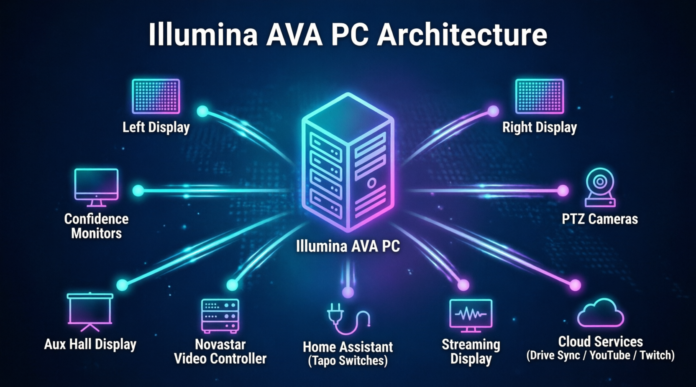

# Illumina AVA PC Deployment Guide

Welcome to the automated deployment system for **Illumina**, the enterprise-grade audio-visual presentation platform designed for live production environments. Built on .NET 10 / ASP.NET Core Blazor with MudBlazor, Illumina is the operational hub for services, media, streaming, recording, and archives.

This guide will walk you through transforming a standard workstation into a dedicated, self-healing Illumina kiosk in just a few minutes. Our automated installers handle environment configuration, secure certificate generation, dependency provisioning, and display calibration seamlessly.



Please select your target operating system below — but first, a quick look at the hardware landscape Illumina is designed to command.

---

## 🔌 Hardware & Network Planning

Before running the installer, plan your physical deployment and network topology. Illumina acts as the central hub of your live production environment, coordinating displays, cameras, and smart infrastructure over the local network.

### Display Outputs
* **Left & Right Displays:** The congregation-facing main outputs. Illumina is device-agnostic — LED video walls, laser projectors, and large-format LCD panels are all first-class citizens.
* **CG Overlay:** A dedicated lower-third/chyron output, always prepared as part of the core display set; typically routed into a broadcast switcher or OBS via capture card.
* **Confidence Monitors:** Smaller windowed previews positioned near the operator or pulpit for lyrics, slides, and stream health.
* **Aux Hall Display:** An overflow-room program player with independent audio routing for cry rooms, foyers, or secondary halls (active when a broadcast setup is enabled).

### Smart Control & Video Processing
* **Novastar Video Controllers:** Illumina speaks to Novastar processors over their local Web API — scheduling day/evening brightness curves and monitoring LED cabinet health without touching the controller's own software.
* **Home Assistant & Tapo Switches:** Illumina integrates with Home Assistant to automate physical power: bring the LED walls and AV racks up or down from the portal (or as part of a service routine) through Tapo smart plugs — no more climbing behind the rack mid-week.

### Cameras & PTZ Integration
* **Supported protocols:** VISCA, Pelco-D, and Pelco-P, over UDP (VISCA-over-IP) or serial (RS-232/RS-485).
* **Placement:** keep PTZ cameras on the same local subnet as the AVA PC for low-latency preset recall and live tally.

### Network Requirements
* **Local subnet (port 80, HTTP):** congregation phones (QR overlay + `/view` page), pulpit tablets (`/tablet`), PTZ control, Novastar API, and Home Assistant all live here — no internet required for any of them. The installer stamps the PC's LAN address automatically so the congregation QR works from day one.
* **Localhost only (port 443, HTTPS):** the operator portal is served securely on this PC alone.
* **Internet access:** Google Drive slide sync, YouTube/Twitch RTMP egress, and first-run dependency provisioning.

---

## 🪟 Option A: Windows 10 / 11 Deployment

### Prerequisites
* A PC running Windows 10 or 11.
* An active internet connection (required to fetch the app and its dependencies).
* Local Administrator privileges for the initial setup.
* Your GitHub Read-Only Token (provided by your IT administrator).
* *Note: Ensure IIS or other local web servers are not actively binding to port 443.*

### Step 1: Open PowerShell as Administrator
1. Right-click the **Start Button** (Windows icon).
2. Select **Terminal (Admin)** or **Windows PowerShell (Admin)**.
3. Click **Yes** if prompted by User Account Control.

### Step 2: Execute the Deployment Script
Copy the command below, right-click inside the PowerShell window to paste it, and press **Enter**:

```powershell
irm https://raw.githubusercontent.com/nickng70/Illumina-Installer/main/install-windows.ps1 -OutFile "$env:TEMP\install-windows.ps1"; Unblock-File "$env:TEMP\install-windows.ps1"; powershell -ExecutionPolicy Bypass -File "$env:TEMP\install-windows.ps1"
```

### Step 3: Interactive Configuration
The installer will guide you through a brief, self-explanatory setup process:
* **Access Token:** Paste your GitHub token (characters are hidden for security).
* **Environment Profile:** Choose between creating a dedicated, locked-down kiosk account (`avauser`) or utilizing the current Windows account (ideal for IT testing or personal laptops).
* **Hardware & Integration Survey:** Five quick questions — Right Display, Streaming/Broadcast, Google Drive sync, Home Assistant device automation, and Novastar controller — calibrate the software to your physical setup. ENTER accepts the safe default (No) for each.
* **Auto Sign-In:** Choose whether the PC should boot directly into Illumina without requiring a password.

### Step 4: Activation & Reboot
Once the script completes, Illumina is fully installed and **live immediately**. You can launch it right away using the new desktop shortcut. 
* If you elected to enable Auto Sign-In, the installer will offer an *optional* reboot to activate the zero-touch boot sequence for all future startups. 

---

## 🐧 Option B: Ubuntu Desktop Deployment

### Prerequisites
* A PC running Ubuntu Desktop (22.04, 24.04, or 26.04 LTS recommended).
* An active internet connection.
* The administrator (`sudo`) password for the PC.
* Your GitHub Read-Only Token (provided by your IT administrator).

### Step 1: Open the Terminal
Press **Ctrl + Alt + T** on your keyboard to open a terminal window.

### Step 2: Execute the Deployment Script
Copy the command below, right-click inside the terminal to paste it, and press **Enter**:

```bash
curl -sSL https://raw.githubusercontent.com/nickng70/Illumina-Installer/main/install-ubuntu.sh -o /tmp/install-ubuntu.sh && sudo bash /tmp/install-ubuntu.sh
```

### Step 3: Interactive Configuration
* **Sudo Password:** Enter your current PC admin password to authorize the installation.
* **Access Token:** Paste your GitHub token when prompted.
* **Environment Profile:** Choose between a dedicated `avauser` or your current Linux account.
* **Hardware & Integration Survey:** Configure displays, streaming, Drive sync, Home Assistant (with optional on-PC Docker installation), and Novastar to match your physical hardware.
* *Note: When typing passwords in the Linux terminal, the screen will remain completely blank (no asterisks will appear). This is standard POSIX security behavior — simply type the password and press Enter.*

### Step 4: Activation & Reboot
The application is fully installed and **live immediately** upon completion. If you configured Auto Sign-In, the script will offer an optional reboot to activate the automated login sequence for future power cycles.

---

## 🧠 Presence-Driven Behavior (What Volunteers Will See)

Illumina is designed around a simple, stress-free rule: **the displays follow the operator.**

* **Wake:** The moment the operator portal is opened on the AVA PC itself, every configured display, confidence monitor, and (if enabled) the broadcast encoder wakes automatically and lands in its saved position.
* **Sleep:** When the last local portal tab closes, everything shuts down gracefully — any live broadcast is finalized first, so recordings and streams are never corrupted.
* **Self-heal:** If a display window crashes or is accidentally closed while an operator is present, the watchdog relaunches it within seconds. A dark wall fixes itself before anyone panics.
* **Remote-safe:** Portals opened from remote laptops or pulpit tablets never wake or sleep the walls — only the AVA PC's own portal controls the room. Two pulpit tablets (speaker + interpreter) can annotate and control concurrently.
* **Refresh-proof:** Browser refreshes and reconnects never lose operator input or live playback state.

---

## 🖥️ Daily Operation & Recovery

Once deployed, the PC is designed to be as stress-free as possible during live services.

### Powering On
If Auto Sign-In was enabled, simply press the power button on the PC. The system will boot, authenticate silently, and wait for the operator portal to open — at which point all displays wake on their own. No manual intervention is required.

### The Desktop Shortcuts
If the portal browser window is accidentally closed, or the system requires a reset, utilize the desktop shortcuts:

| Shortcut | Purpose | System Behavior |
| :--- | :--- | :--- |
| **Illumina** | **Standard Launch** | Verifies the backend service is running and opens the operator portal. Completely non-destructive; safe to click at any time, even during a live broadcast. |
| **Restart Illumina** | **Emergency Recovery** | Force-closes the backend and all associated kiosk display windows, then performs a clean launch. *Warning: This will terminate any active broadcast streams or recordings.* |

---

## 🔄 Seamless Software Updates

Illumina utilizes an **idempotent deployment model**. When your IT team releases a new version, you do not need to uninstall anything.

Simply re-run the **exact same installation command** (from Step 2 above) for your operating system. The installer is intelligent: it will automatically back up and preserve your local media libraries, download the newest compiled binaries, and seamlessly apply the update in place.

---

## 🛡️ Architecture & Security Posture

* **Principle of Least Privilege:** When deployed in Kiosk Mode, the application runs under a strictly confined Standard User account. This prevents unauthorized system modifications, accidental software installations, and protects the OS integrity.
* **Automated Dependency Provisioning:** The installer automatically detects and provisions all required companion software: Google Chrome (the display rendering engine), LibreOffice (for slide conversion), and FFmpeg (for broadcast encoding). IT administrators do not need to manually hunt for, download, or configure third-party binaries.
* **Native Content Security:** Proprietary media assets and application libraries are secured using native OS-level permissions (Windows ACLs / Linux POSIX `chmod`). Content is strictly isolated and inaccessible to unauthorized user profiles or external browsing.
* **Closed-Source Delivery:** The deployment pipeline fetches only the compiled, production-ready binaries. Source code and development artifacts are never exposed to the endpoint machine.
* **Automated Cryptography:** The installer automatically generates and trusts a private, machine-local HTTPS certificate, ensuring encrypted local traffic without relying on external certificate authorities or exposing the portal to the public internet.
* **Minimal Network Surface:** HTTPS is bound to localhost only; the single inbound LAN endpoint is plain HTTP on port 80 for congregation phones and tablets — matching the platform's documented binding contract exactly.

---

## 🧹 For IT Administrators: Full Uninstall

> **You almost never need this.** Re-running the installer is the correct recovery path for 99% of problems. This section is only for **decommissioning a PC** or repairing a fundamentally corrupted installation.

The uninstaller preserves your content folders by default (offering a backup location), removes the application, shortcuts, firewall rules, machine certificate, and stored secrets — and leaves general-purpose companions (Chrome, LibreOffice, FFmpeg, Home Assistant) untouched.

**Windows:**
```powershell
irm https://raw.githubusercontent.com/nickng70/Illumina-Installer/main/uninstall-windows.ps1 -OutFile "$env:TEMP\uninstall-windows.ps1"; Unblock-File "$env:TEMP\uninstall-windows.ps1"; powershell -ExecutionPolicy Bypass -File "$env:TEMP\uninstall-windows.ps1"
```

**Ubuntu:**
```bash
curl -sSL https://raw.githubusercontent.com/nickng70/Illumina-Installer/main/uninstall-ubuntu.sh -o /tmp/uninstall-ubuntu.sh && sudo bash /tmp/uninstall-ubuntu.sh
```
